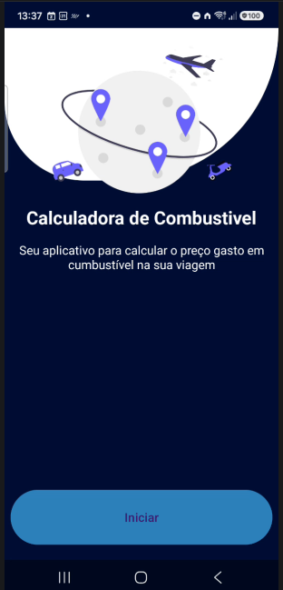
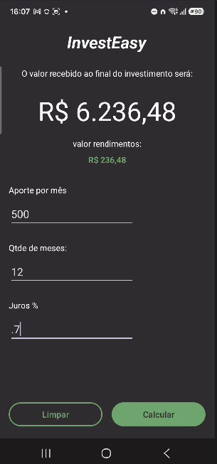
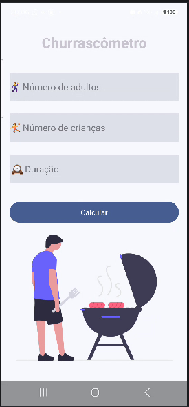

# Nova Era

Portfólio de apps Android desenvolvidos nos desafios **10D**, **20D** e **100D**.

Cada desafio reúne exemplos práticos — da tela inicial ao cálculo final — para registrar o que foi aprendido e o que vem a seguir.

## Desafios

| Trilha | Foco | Status |
| --- | --- | --- |
| [10D](#desafio-10d) | Apps de cálculo com múltiplas telas, Intent e Material 3 | Em andamento |
| [20D](#desafio-20d) | Próxima trilha | Em breve |
| [100D](#desafio-100d) | Trilha avançada | Em breve |

## Desafio 10D

Apps curtos, com fluxo em etapas e resultado na última tela.

### FuelCalculator

Calcula o custo de combustível de uma viagem a partir do preço do litro, do consumo do veículo e da distância.

**Fluxo:** Início → Preço → Consumo → Distância → Resultado

| | |
| --- | --- |
| Status | Concluído |
| Pasta | [`NovaEra10D/FuelCalculator`](NovaEra10D/FuelCalculator) |
| Stack | Kotlin, XML Views, Material 3, Activities + Intent extras |

O usuário informa o preço do litro, o consumo (km/L) e a distância. O app estima os litros necessários e o valor total da viagem.

### EasyInvest

Aplicativo para calcular o valor de rendimentos em um investimento dado percentual de juros mensal.

### Churrascometro

Aplicativo para calcular quantidade de carne, cerveja e refrigerante.

## Desafio 20D

Trilha intermediária. Os exemplos entram aqui quando o desafio começar.

## Desafio 100D

Trilha avançada. Os exemplos entram aqui quando o desafio começar.
